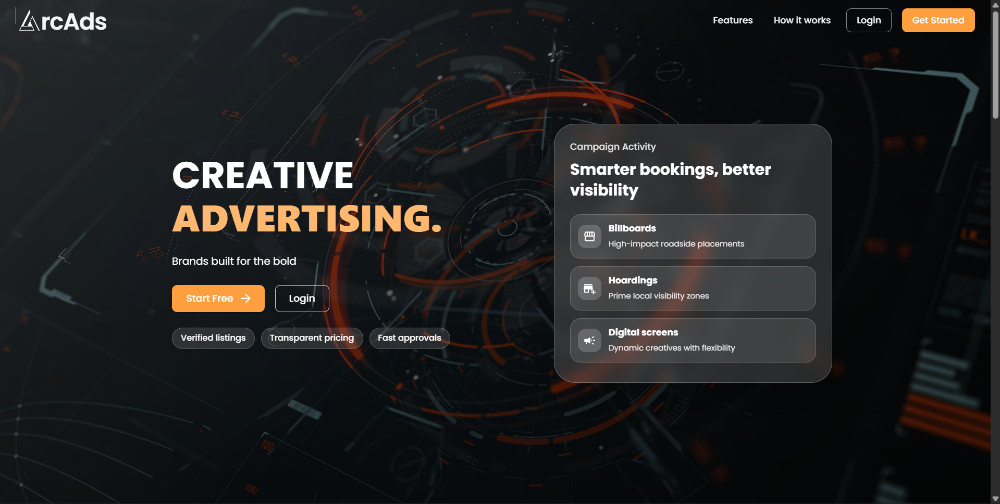
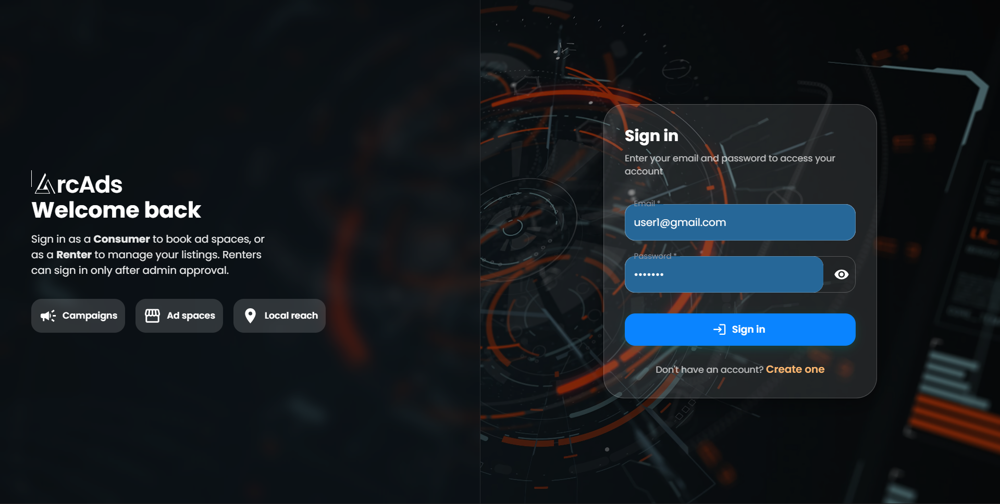
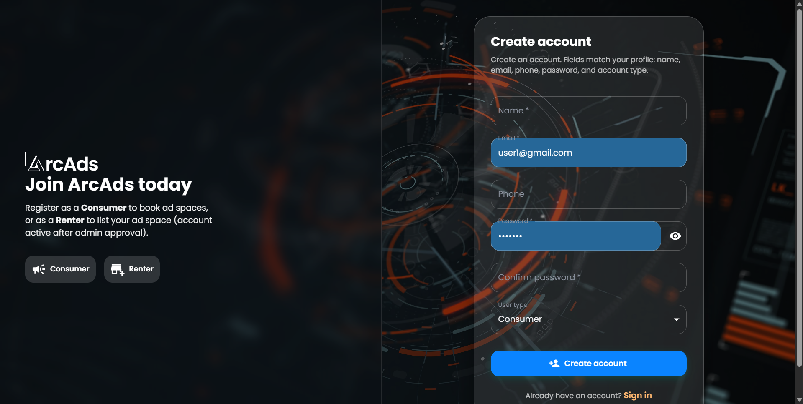
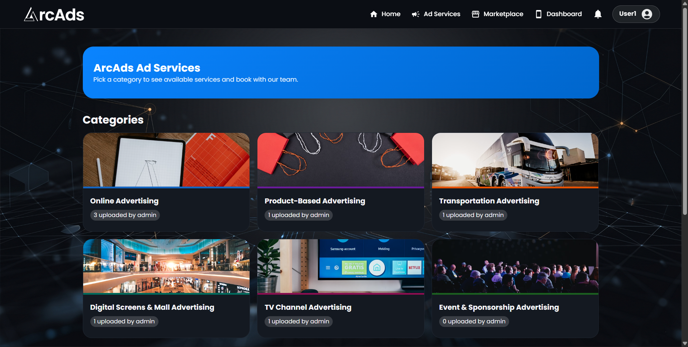

# ArcAds – Multi-Channel Advertising Management Platform

A comprehensive full-stack web application connecting **Advertisers** with **Space Owners** (billboards, hoardings, digital screens) and providing platform-managed **Ad Services** (transit advertising, product campaign advertising, digital screen management, etc.). 

Built with **React 19**, **Vite**, **Material UI (MUI)**, **Framer Motion**, **Node.js**, **Express**, and **MySQL/Sequelize**.

## ✨ Key Features

- **Multi-Role Architecture:** 
  - `advertiser`: Browse the marketplace, book spaces, and inquire about ad services.
  - `space_owner`: List and manage physical ad spaces. Accept or reject booking requests.
  - `admin`: Platform management, comprehensive dashboard with statistics, service management with role-based visibility, space verification, and global platform oversight.
- **Dynamic Marketplace:** Filter, search, and browse available Ad Spaces by location, type, and dates. Includes images and media galleries.
- **In-House Ad Services:** Admin-created services (Digital Screens, Transportation, Merchandise, etc.) with customizable booking flows and tier-based pricing.
- **Robust Media Uploads:** Seamless media uploads via Multer supporting large video files up to 500MB and high-res image playback.
- **Automated Workflows:** Cron jobs running daily database maintenance, expiration checks, and email notifications.

## 🛠 Tech Stack

| Layer | Technologies |
|-------|--------------|
| **Frontend** | React 19, Vite, Material UI (MUI v6), React Router v7, Framer Motion, Axios, Day.js |
| **Backend** | Node.js, Express.js, MySQL, Sequelize ORM, Multer, Node-cron, Nodemailer |
| **Auth** | Basic email/password authentication with role-based access control |

## 📂 Folder Structure

```text
ArcAds/
├── Backend/
│   ├── config/      # Sequelize + MySQL connection setup
│   ├── controllers/ # Logic for Auth, Spaces, Services, Bookings, Admin
│   ├── models/      # Sequelize Models (User, AdSpace, Booking, AdService, etc.)
│   ├── middleware/  # File upload (Multer) & other middlewares
│   ├── routes/      # Express Router definitions
│   ├── scripts/     # Automation scripts (node-cron scheduled jobs)
│   ├── index.js     # Entry point for Backend APIs & DB Synchronization
│   └── .env.example # Environment Variables Example
├── frontend/
│   ├── src/
│   │   ├── api/     # Axios configurations & API endpoints
│   │   ├── components/# Reusable UI Components
│   │   ├── context/ # Global Context Providers (e.g. AuthContext)
│   │   ├── pages/   # Role-based dashboards, Marketplace, Booking flows, Landing
│   │   ├── App.jsx  # Main application routing and logic
│   │   └── main.jsx # React application render entry
│   ├── vite.config.js
│   └── package.json
└── README.md
```

## 🚀 Setup & Run Locally

### 1. MySQL Configuration

- Create a local database, e.g., `CREATE DATABASE arcads;`
- Ensure you have MySQL running locally.
- Configure your credentials in `Backend/.env` (using `.env.example` as a template).

### 2. Backend Initialization

```bash
cd Backend
npm install
cp .env.example .env
# Edit .env and supply DB_NAME=arcads, DB_USER, DB_PASSWORD, etc.
npm start
```
*Note: The server runs at `http://localhost:5000`. Tables are auto-created on the first run via Sequelize's `sync()`.*

### 3. Frontend Initialization

```bash
cd frontend
npm install
npm run dev
```
*Application runs at `http://localhost:5173`. Vite is configured to proxy `/api` traffic to your backend.*

### 4. Admin User Creation (Optional)

Auth relies on plain email/password input for demonstration purposes. To establish an admin account out-of-the-box, insert a record into MySQL:

```sql
INSERT INTO Users (email, password, name, role, createdAt, updatedAt) 
VALUES ('admin@arcads.com', 'admin123', 'Super Admin', 'admin', NOW(), NOW());
```

## 🗄️ Database Models (Overview)

- **Users:** Core identities configured by roles (`advertiser`, `space_owner`, `admin`).
- **AdSpaces:** Physical billboards/nodes owned by Space Owners.
- **AdServices:** Platform-run services with various dynamic category setups.
- **Bookings:** Relational states tracking an Advertiser's order for an Ad Space.
- **AdServiceInquiries:** Relational states tracking an Advertiser's order for an Ad Service.
- **Reviews:** Ratings and comments connected to completed bookings.
- **Additionally:** `Notifications`, `AdTemplates`, `Payments`.

## 🌐 Core API Endpoints

| Path | Description |
|------|-------------|
| `POST /api/auth/login` | Login user (returns user payload) |
| `POST /api/auth/signup` | Register an Advertiser or Space Owner |
| `GET /api/adspaces` | Fetch all approved spaces |
| `POST /api/adspaces` | Create an Ad Space (requires `space_owner` role) |
| `GET /api/ad-services` | Fetch all active Ad Services (platform-run options) |
| `POST /api/bookings` | Submit a booking for an Ad Space |
| `POST /api/ad-service-inquiries`| Submit an inquiry/booking for an Ad Service |
| `GET /api/admin/dashboard`| Administrative aggregated platform stats |

*All authenticated requests supply `X-User-Id: <userId>` established via frontend storage.*

## 📸 Preview

<div align="center">
  
  &nbsp;
  
  <br/>
  <br/>
  
  &nbsp;
  
</div>

